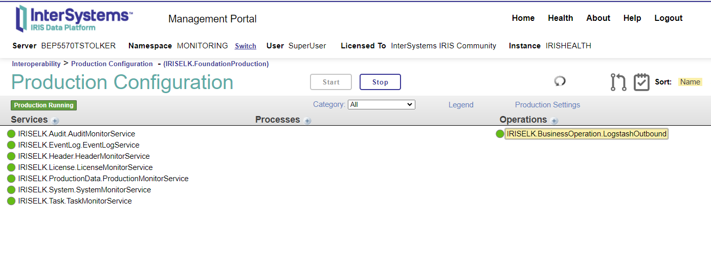

## What is InterSystems-Monitoring?
[Intersystems-Monitoring](https://openexchange.intersystems.com/package/Intersystems-Monitoring) is an add-on package that you can add to any existing solution based on InterSystems IRIS and HealthConnect. It installs a Monitoring Production which collects information from the relevant Ensemble namespaces and send status update to Logstash, so that you can monitor your InterSystems Productions from [Kibana Discover](https://www.elastic.co/guide/en/kibana/current/discover.html) 

A couple of important remarks before we dive deeper:
1. **This is not a standalone solution**, it is an **add-on** supposed to be run with an existing installation. This means you won't find a docker-compose.
2. You need to set up your own [Elastic Logstash](https://www.elastic.co/logstash) instance. This is not part of this repository.

## What is Elastic?
The [Elastic stack](https://www.elastic.co/elastic-stack/), is comprised of Elasticsearch, Kibana, Beats, and Logstash. You might know it as the [ELK Stack](https://www.elastic.co/what-is/elk-stack). It allows you to take data from heterogeneous sources, in any format, then search, analyze, and visualize.

If you target an organization that already knows and loves [Elastic stack](https://www.elastic.co/elastic-stack/), [Intersystems-Monitoring](https://openexchange.intersystems.com/package/Intersystems-Monitoring) is a great add-on for your InterSystems IRIS and HealthShare HealthConnect-based solutions. If you are looking for a powerful way to monitor heterogeneous applications, you might want to tale a look at [Elastic stack](https://www.elastic.co/elastic-stack/) too!

[Itzos](https://itzos.com/), a Dutch systems integrator, has been using [Intersystems-Monitoring](https://openexchange.intersystems.com/package/Intersystems-Monitoring) for years to allow them viewing the state and events of the many InterSystems IRIS and HealthConnect instances they run using [Kibana Discover](https://www.elastic.co/guide/en/kibana/current/discover.html) - and they love it. They felt that sharing this with the InterSystems Community was a great way to give back.

## Event Sources - What information is transmitted to logstash
The following information is being transmitted to logstash:
1. Audit records from %SYS.Audit - Incremental
2. License info from %SYSTEM.License (KeyLicenseCapacity and KeyExpirationDate)
3. Prometheus Metrics from SYS.Monitor.SAM.Sensors
4. Task history from %SYS_Task.History - Incremental

The following information is being transmitted to logstash from each Ensemble namespace:
1. Production Name and Status
2. Message headers from Ens.MessageHeader - Incremental
3. Eventlog records from Ens_Util.Log - Incremental

## Basic Structure and Working
The InterSystems-Monitoring package provides a foundation production named **IRISELK.FoundationProduction**.
This contains:
  - A Business service for each of the 7 event sources mentioned above, which by default all transmit data once every minute.
  - For each type of information that is sent incremental, a lastkey value is persisted to allow sending only new data.
  - All Services send the collected data to Logstah via the Business Operation named IRISELK.BusinessOperation.LogstashOutbound

The package has a post-install step that configures IRISELK.FoundationProduction to run and autostart in the designated Monitoring namespace

## Seting up InterSystems-Monitoring
InterSystems-Monitoring can be installed from package intersystems-monitoring using InterSystems Package Manager (ZPM).

Before that, make sure that you have a new namespace where you run the Monitoring production, which we usually call "MONITORING"

You might use method **PreInstall()** in class **IRISELK.Setup.installer** which you can download here: [installer.cls](https://github.com/ItzosNL/Intersystems-Monitoring-Elastic/blob/master/src/IRISELK/Setup/installer.cls).

You need to compile it and then call **PreInstall()**:

`set sc = ##class(IRISELK.Setup.installer).PreInstall()`

This will create the "MONITORING" namespace with seperate databases for Code and Data, so that a package mapping can be created for only the Code database to the %All namespace

Then, switch to the newly created namespace:

`zn "MONITORING"`

and install the Intersystems-Monitoring package:

`ZPM "install intersystems-monitoring"`

This will:
- Load the **IRISELK** Package
- Call **PostInstall** method of class **IRISELK.Setup.installer**, which will:
  - Create the %All namespace if it doesn't exists yet
  - Create a packagemapping for the IRISELK package from the Code-database of your namespace to the %All namespace.
    This is needed so that code can be called from all Ensemble-enabled namespaces
  - Create the SSL Configuration named "Default" as used by the Logstash sender if it doesn't exist yet
  - Sets the config based on the assumption that there is a json configuration file in location "/usr/irissys/mgr/config.json"

After the package has been installed, you can override the configuration by calling the **SetConfig** method on class **IRISELK.BusinessOperation.Config** with the path of your own config file:

  `do ##class(IRISELK.BusinessOperation.Config).SetConfig("your config json location")`

Last step is to start the production and set it to Autostart:

  `do ##class(IRISELK.Setup.installer).AutoStartProduction()`

Now, when you switch to the "MONITORING" namespace and view the Production, you'll see a picture like this:

## Sample Configuration file
This is a sample configuration file for InterSystems-Monitoring

{

    "stage": "dev|tst|acc|prd|other",

    "description": "Description of the business purpose of the instance",

    "customer": "Name of customer",

    "logstash-url": "url of the logstash instance, e.g. https://mydomain.com/logstash",

    "logstash-ssl-config":  "Default",

    "logstash-check-server-identity":  false,

    "logstash-proxy-address": "optional proxy address, e.g. http://my-proxy.com:8081"

}

Please note that the config.json is re-read each time before a transfer is made to Logstash.

## Standard header information sent to logstash
The Business Operation includes the following context information and includes it as HTTP headers:
| Header name           | Value                                                                                               |
| :-------------------- | :-------------------------------------------------------------------------------------------------- |
| server_name           | ##class(%Library.Function).HostName(), converted to lowercase. On Kubernetes, remove the pod-prefix |  
| k8s_namespace         | Kubernetes namespace - only when on Kubernetes                                                      |
| instance_name         | ##class(%SYS.System).GetInstanceName(), converted to lowercase.                                     |
| instance_product_type | "IRIS for Health" or "HealthConnect" or "IRIS"                                                      |
| instance_otap         | stage property from config.json, expected values: "dev", "tst", "acc", "prd", or "other"            |
| instance_description  | description property from config.json, should describe the business purpose of the instance         |
| server_client_name    | customer property from config.json, can be filled with the customer name                            |

## What you need to do in logstash to process your information
In order for the data to be stored in Elasticsearch, it first needs to be filtered in Logstash. Logstash needs a pipeline to filter this data. An example for this pipeline is provided within this repository called "pipeline.conf". The `input` section of this file contains the configuration for the inbound traffic from the Intersystems-Monitoring production. See the comments in the example file for more details.

The `filter` section of this file already contains the necessary filters for the data from the Intersystems-Monitoring production. If you wish to add a service to the production, you can use the existing filters as a guideline. You could add the following to the pipeline to add data from a new service:

	# rename array for filtering purposes in Kibana
	else if [<NewDataName>] {
		mutate {
			rename => ["<NewDataName>", "iris" ]
		}
		# split array into seperate messages
		split {
			field => "iris"
		}
		# add target index for Elasticsearch and remove orginal message field
		mutate {
			add_field => { "[@metadata][target_index]" => "iris_newdataname_%{[headers][instance_name]}_%{[headers][instance_otap]}_%{+YYYY.MM}" } # name of index needs to be in lowercase!
			remove_field => [ "message" ]
		}
	}
 
The `output` section of this file contains the configuration for the outbound traffic to Elasticsearch. See the comments in the example file for more details.

## Embedding InterSystems-Monitoring in another project
It is recommended that you include the setup of the IRISELK Monitoring production in your own installer, so that you it can be automatically deployed.
These are the steps needed to make that work:
1. Make sure that the Intersystems Package Manager (ZPM) is loaded. This is automatically the case for the Community Edition, but needs to be done as a separate step in your project if you run with a commercial license key
2. Install the intersystems-monitoring pqackage using ZPM

   `ZPM "install intersystems-monitoring"`

3. Make sure that you have a json config file that is properly configured for your instance

4. Call the **SetConfig** method on class **IRISELK.BusinessOperation.Config** to set 
	
    `do ##class(IRISELK.BusinessOperation.Config).SetConfig("your config json location")`

## Known issues
There are no known issues at this point in time

## Finally
Use or operation of this code is subject to acceptance of the license available in the code repository for this code.

